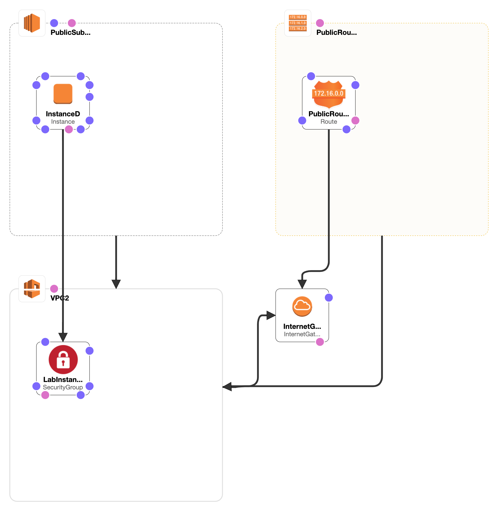

# Lab 1 (Content Version 7.1.10)

## Optional Task 4: Examine and run a second CloudFormation template

`optional.yaml`

```yaml
AWSTemplateFormatVersion: 2010-09-09

Description: Lab1 template which builds a VPC with 1 public subnet and 1 SG

Parameters:

  VPCCIDR:
    Description: CIDR Block for VPC
    Type: String
    Default: 10.2.0.0/16
    AllowedValues:
      - 10.2.0.0/16

  PublicSubnet2Param:
    Description: Public Subnet 2
    Type: String
    Default: 10.2.11.0/24
    AllowedValues:
      - 10.2.11.0/24

  AmazonLinuxAMIID:
    Type: AWS::SSM::Parameter::Value<AWS::EC2::Image::Id>
    Default: /aws/service/ami-amazon-linux-latest/amzn2-ami-hvm-x86_64-gp2

Resources:

  VPC2:
    Type: 'AWS::EC2::VPC'
    Properties:
      CidrBlock: !Ref VPCCIDR
      EnableDnsSupport: True
      EnableDnsHostnames: True
      InstanceTenancy: 'default'
      Tags:
        - Key: Name
          Value: LabVPC2

  InternetGateway:
    Type: 'AWS::EC2::InternetGateway'

  AttachGateway:
    Type: 'AWS::EC2::VPCGatewayAttachment'
    Properties:
      VpcId: !Ref VPC2
      InternetGatewayId: !Ref InternetGateway

  PublicSubnet2:
    Type: 'AWS::EC2::Subnet'
    Properties:
      VpcId: !Ref VPC2
      CidrBlock: !Ref PublicSubnet2Param
      MapPublicIpOnLaunch: True
      AvailabilityZone: !Select
        - '0'
        - !GetAZs ''
      Tags:
        - Key: Name
          Value: LabPublicSubnet2

  PublicRouteTable:
    Type: 'AWS::EC2::RouteTable'
    Properties:
      VpcId: !Ref VPC2
      Tags:
        - Key: Name
          Value: PublicRouteTable

  PublicRoute:
    Type: 'AWS::EC2::Route'
    Properties:
      RouteTableId: !Ref PublicRouteTable
      DestinationCidrBlock: 0.0.0.0/0
      GatewayId: !Ref InternetGateway

  PublicSubnet1RouteTableAssociation:
    Type: 'AWS::EC2::SubnetRouteTableAssociation'
    Properties:
      SubnetId: !Ref PublicSubnet2
      RouteTableId: !Ref PublicRouteTable

  LabInstanceSecurityGroup2:
    Type: 'AWS::EC2::SecurityGroup'
    Properties:
      GroupDescription: Security Group allowing HTTP traffic for lab instances
      VpcId: !Ref VPC2
      Tags:
        - Key: Name
          Value: LabInstanceSecurityGroup2
      SecurityGroupIngress:
        - IpProtocol: tcp
          FromPort: 80
          ToPort: 80
          CidrIp: 0.0.0.0/0
  
###########
# EC2 instance creation and installs a simple web application
###########

  InstanceD:
    Type: AWS::EC2::Instance
    Properties:
      ImageId: !Ref AmazonLinuxAMIID
      InstanceType: 't3.micro'
      SubnetId: !Ref PublicSubnet2
      SecurityGroupIds:
        - !Ref LabInstanceSecurityGroup2
      UserData: !Base64 |
        #!/bin/bash -ex
        sudo yum update -y
        sudo yum install -y httpd php
        sudo service httpd start
        sudo systemctl enable httpd.service
        cd /var/www/html
        wget https://us-west-2-tcprod.s3.amazonaws.com/courses/ILT-TF-200-ARCHIT/v7.1.8/lab-1-EC2/scripts/instanceDdata.zip
        unzip instanceDdata.zip
      Tags:
        - Key: Name
          Value: InstanceD

Outputs:

  InstanceDPublicDNS:
    Description: 'Public DNS value for InstanceD'
    Value: !GetAtt InstanceD.PublicDnsName
```
`optional.yaml` in CloudFormation Designer


