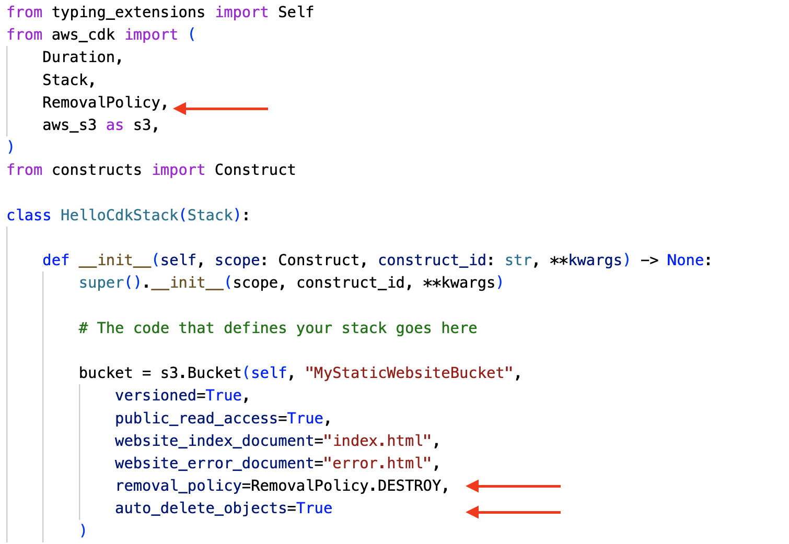

# AWS CDK Sample App

[docs]:https://docs.aws.amazon.com/cdk/v2/guide/hello_world.html

This document is my short version of the [step-by-step guide][docs] in the *AWS CDK v2 Developer Guide*.

For more information about CDK, constructs, and the Python code refer to this guide.

## Goal

Goal is to create a S3 bucket with static web site configuration and public access using AWS CDK (Python). Upload an index.html file to the bucket (via AWS console) and you have a running static website.


## Prerequisites


You have to install the AWS CDK

````bash
npm install -g aws-cdk
cdk --version
````

Then you need to create a bootstrap stack. Read [here](https://docs.aws.amazon.com/cdk/v2/guide/bootstrapping.html) about bootstrapping.
````bash
cdk bootstrap aws://<account number>/eu-central-1
````

AWS CLI is needed for some commands. For information how to install [see here](https://docs.aws.amazon.com/cli/latest/userguide/getting-started-install.html).

````bash
aws --version
````

As code editor I use VS Code.

A Python installation is **not** required because CDK creates a [virtual Python environment](https://docs.python.org/3/tutorial/venv.html).

## Overall workflow

From [step-by-step guide][docs]

1. Create the app from a template provided by the AWS CDK
2. Add code to the app to create resources within stacks
3. Build the app (optional; the AWS CDK Toolkit will do it for you if you forget)
4. Synthesize one or more stacks in the app to create an AWS CloudFormation template
5. Deploy one or more stacks to your AWS account


## Create the app 

````bash
mkdir hello-cdk
cd hello-cdk
cdk init app --language python
source .venv/bin/activate
python -m pip install -r requirements.txt
ls -l
````

## List the stacks in the app

````bash
cdk ls
````

## Add an Amazon S3 bucket

Tipp: If you recieve *Import "contructs" could not be resolved* 


select the Python interpreter matching

````bash
which python
````

Edit `hello_cdk/hello_cdk_stack.py`

````python
from typing_extensions import Self
from aws_cdk import (
    Duration,
    Stack,
    aws_s3 as s3,
)
from constructs import Construct

class HelloCdkStack(Stack):

    def __init__(self, scope: Construct, construct_id: str, **kwargs) -> None:
        super().__init__(scope, construct_id, **kwargs)

        # The code that defines your stack goes here

        bucket = s3.Bucket(self, "MyStaticWebsiteBucket",
            versioned=True,
            public_read_access=True,
            website_index_document="index.html",
            website_error_document="error.html"
        )
````

## Synthesize an AWS CloudFormation template

````bash
cdk synth
````

## Deploying the stack

````bash
cdk deploy
````

````bash
aws cloudformation describe-stacks --query "Stacks[*].{StackName:StackName,StackStatus:StackStatus}" --output table
stackName='HelloCdkStack'
aws cloudformation describe-stacks --stack-name $stackName
aws cloudformation describe-stack-resources --stack-name $stackName --query "sort_by(StackResources[*].{LogicalResourceId:LogicalResourceId,ResourceType:ResourceType,ResourceStatus:ResourceStatus}, &ResourceType)" --output table
````

## Modifying the app

Update `hello_cdk/hello_cdk_stack.py`




````bash
cdk diff
cdk deploy
````

## Destroying the app's resources

````bash
cdk destroy
````

## Remove app

````bash
deactivate
cd ..
rm -r hello-cdk
````