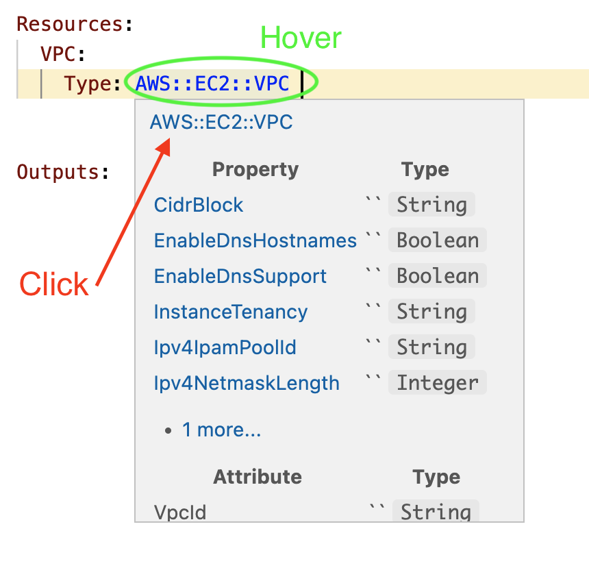

# Using AWS CloudFormation in VS Code

## Extensions

* [CloudFormation extension](https://marketplace.visualstudio.com/items?itemName=aws-scripting-guy.cform) is a collection of snippets. ❌ Don't install it, but use it's snippets as a starting point for your own snippets.

* [Serverless IDE](https://marketplace.visualstudio.com/items?itemName=ThreadHeap.serverless-ide-vscode)  has nice integration to AWS docs. ✅ Install it.


## Snippets

Command Palette → Snippets: Configure User Snippets → yaml

### Blank template

````json
{
    "cloudFormation template": {
		"prefix": "cfn",
		"body": [
			"AWSTemplateFormatVersion: 2010-09-09",
			"\r",
			"Description: ${1} |-",
			"\r",
			"Metadata: ",
			"\r",
			"Parameters: ",
			"\r",
			"Mappings: ",
			"\r",
			"Conditions: ",
			"\r",
			"Resources: \r\t${2}",
			"\r",
			"Outputs: "
		]
	},
}	
````

### S3 bucket

````json
{
	"s3-bucket": {
		"prefix": "s3-bucket",
		"body": [
			"${1:s3Bucket}:",
			"  Type: AWS::S3::Bucket",
			// https://docs.aws.amazon.com/AWSCloudFormation/latest/UserGuide/aws-attribute-deletionpolicy.html
			"  DeletionPolicy: ${2|Delete, Retain, Snapshot|}",
			"  Properties: ",
			"    AccessControl: ${3|Private, PublicRead, PublicReadWrite, AuthenticatedRead, LogDeliveryWrite, BucketOwnerRead, BucketOwnerFullControl, AwsExecRead|}",
			"    BucketName: ${4}",
			"    Tags:",
			"      - Key: ${5:key}",
			"        Value: ${6:value}"
		],
		"description": "",
	}

}
````

## Workflow

1. Create new file
2. Set language mode to yaml
3. Type *cfn* to trigger the snippet for a blank template
4. Use Intellisense to get the ARN from extention *Serverless IDE*


5. Hover over and click to get the AWS docs


