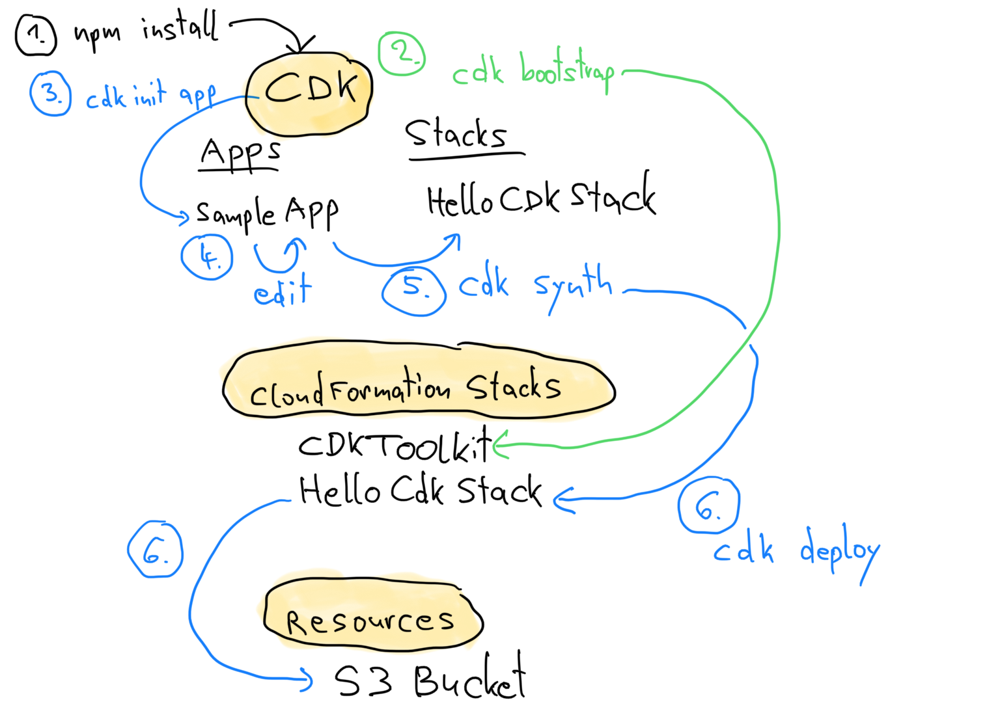
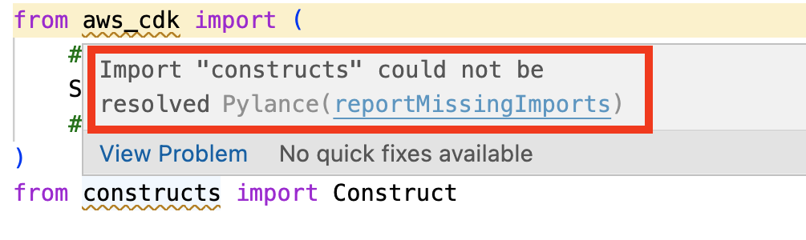
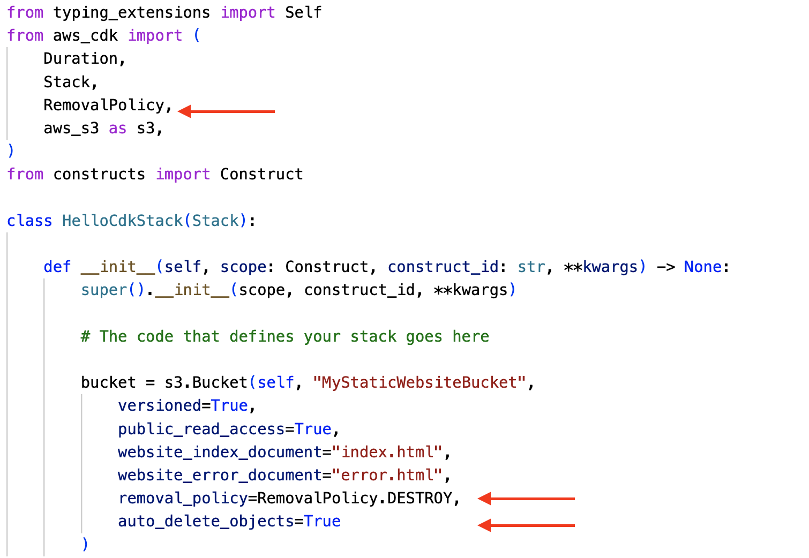

# AWS CDK Sample App

[docs]:https://docs.aws.amazon.com/cdk/v2/guide/hello_world.html

### Origin

This document is my short version of the [AWS CDK v2 Developer Guide][docs]. If you have any questions about CDK, constructs, and the Python code refer to this guide.

### Goal

Goal is to create a S3 bucket with static web site configuration and public access using AWS CDK (Python). Upload an index.html file to the bucket and you have a running static website.


### Prerequisites

npm is needed to install the CDK package.

```bash
npm --version
```


### No Prerequisites

A Python installation is **not** required because CDK creates a [virtual Python environment](https://docs.python.org/3/tutorial/venv.html).

AWS CLI is **not** a prerequisite for CDK, but is very useful. For installation [see here](https://docs.aws.amazon.com/cli/latest/userguide/getting-started-install.html).

```bash
aws --version
```

You need to edit the Python code. As code editor I prefer [VS Code](https://code.visualstudio.com/).


## Overall workflow




## Step 1: Install CDK

```bash
npm install --global aws-cdk

cdk --version
```


## Step 2: Bootstrap CDK

You need to create a CDK bootstrap stack. Read [here](https://docs.aws.amazon.com/cdk/v2/guide/bootstrapping.html) about bootstrapping.

```bash
accountNumber='111111111111'
region='eu-central-1'

cdk bootstrap "aws://$accountNumber/$region"
```

Review the CDK bootstrap stack

```bash
aws cloudformation describe-stacks --query "Stacks[*].{StackName:StackName,StackStatus:StackStatus}" --output table

stackName='CDKToolkit'

aws cloudformation describe-stack-resources --stack-name $stackName --query "sort_by(StackResources[*].{LogicalResourceId:LogicalResourceId,ResourceType:ResourceType,ResourceStatus:ResourceStatus}, &ResourceType)" --output table
```


## Step 3: Create the Python App 

```bash
mkdir hello-cdk
cd hello-cdk

cdk init app --language python

source .venv/bin/activate
python -m pip install -r requirements.txt
ls -l
```

List the stacks in the app

```bash
cdk list
```

## Step 4: Edit the Python App

We want to add a S3 bucket to the stack inside the Python code.

Open `hello_cdk/hello_cdk_stack.py` in your code editor.

---
Tipp:

If you recieve *Import "contructs" could not be resolved* 



select the Python interpreter matching

```bash
which python
```
---


Replace everything with this code: 

```python
from aws_cdk import (
    Duration,
    Stack,
    aws_s3 as s3,
)
from constructs import Construct

class HelloCdkStack(Stack):

    def __init__(self, scope: Construct, construct_id: str, **kwargs) -> None:
        super().__init__(scope, construct_id, **kwargs)

        # The code that defines your stack goes here

        bucket = s3.Bucket(self, "MyStaticWebsiteBucket",
            versioned=True,
            public_read_access=True,
            website_index_document="index.html",
            website_error_document="error.html"
        )
```

## Step 5: Synthesize the Template for the CloudFormation Stack

```bash
cdk synth
```

## Step 6: Deploying the stack

```bash
cdk deploy
```

```bash
aws cloudformation describe-stacks --query "Stacks[*].{StackName:StackName,StackStatus:StackStatus}" --output table
stackName='HelloCdkStack'
aws cloudformation describe-stacks --stack-name $stackName
aws cloudformation describe-stack-resources --stack-name $stackName --query "sort_by(StackResources[*].{LogicalResourceId:LogicalResourceId,ResourceType:ResourceType,ResourceStatus:ResourceStatus}, &ResourceType)" --output table
```

## Optional Step 7: Modifying the app

Update `hello_cdk/hello_cdk_stack.py`




```bash
cdk diff
cdk deploy
```

## OptionalStep 8: Clean up

### Delete CloudFormation Stack and (hopefully) all it's Resources

```bash
cdk destroy
```

### Delete the App

```bash
deactivate
cd ..
rm -r hello-cdk
```

### Remove Bootstrap Stack

```bash
stackName='CDKToolkit'
aws cloudformation delete-stack --stack-name $stackName
aws cloudformation describe-stacks --query "Stacks[*].{StackName:StackName,StackStatus:StackStatus}" --output table
```